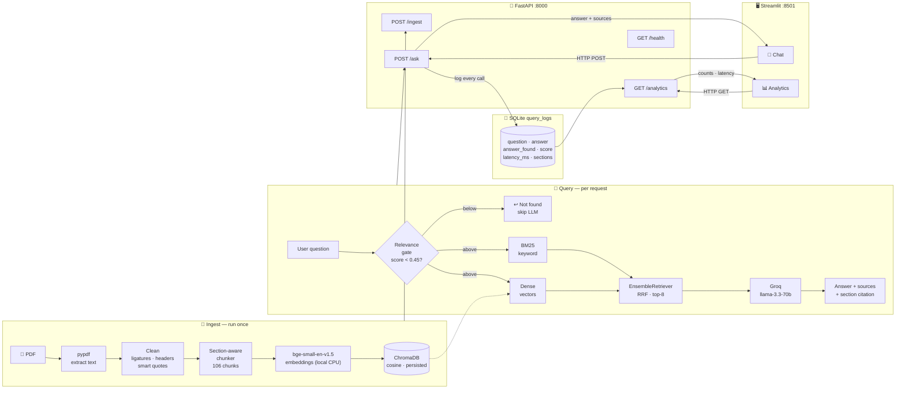

# AWS Customer Agreement — RAG Q&A System

This is a question-answering system for the **AWS Customer Agreement**. You ask a
question in plain English, and it finds the relevant clauses in the contract and
answers from them — citing the section it used, and telling you honestly when the
answer isn't in the document instead of making something up.

It's built as a FastAPI backend that logs every question to a SQLite database,
with a Streamlit app on top for chatting and viewing usage analytics. Everything
that can run locally does (the embeddings), and the only hosted piece is answer
generation, which uses Groq's free API — so there's no cost to run it.

A few things worth calling out up front:

- **Retrieval is hybrid** — keyword search (BM25) combined with dense vector
  search, so it handles both exact legal terms and loosely-worded questions.
- **Embeddings** are `BAAI/bge-small-en-v1.5`, running locally on CPU.
- **Vector store** is ChromaDB, persisted to disk.
- **LLM** is Groq's `llama-3.3-70b-versatile`.
- **Answers cite their source section**, and out-of-scope questions get a
  "not found" reply rather than a hallucinated one.


---

## Architecture

The system has two phases — **ingest** (run once to build the index) and **query**
(runs on every question). The Streamlit frontend and FastAPI backend are separate
processes that only talk over HTTP.



### Project structure

```
vstaff_assignment/
├── data/aws_customer_agreement.pdf   # the source document
├── app/
│   ├── config.py          # all settings and design constants in one place
│   ├── ingest.py          # parsing, cleaning, section-aware chunking
│   ├── vectorstore.py     # embeddings + the persisted Chroma store
│   ├── rag.py             # hybrid retrieval, the not-found gate, generation
│   ├── db.py              # SQLite schema, logging, analytics queries
│   ├── schemas.py         # Pydantic request/response models
│   └── main.py            # the FastAPI app
├── frontend/streamlit_app.py        # chat + analytics UI
├── scripts/run_test_queries.py      # fires 36 questions to populate the logs
├── requirements.txt
├── .env.example
└── README.md
```

---

## Getting it running

You'll need Python 3.10 or newer (I built it on 3.13) and a free Groq API key,
which you can create at https://console.groq.com/keys — no credit card needed.

### 1. Clone it and set up a virtual environment

```bash
git clone <your-repo-url>
cd vstaff_assignment

python -m venv .venv
# Windows:
.venv\Scripts\activate
# macOS / Linux:
# source .venv/bin/activate
```

### 2. Install the dependencies

```bash
pip install -r requirements.txt
```

The first time you ingest, it'll download the `bge-small-en-v1.5` embedding model
(around 130 MB). That's a one-time thing.

### 3. Add your API key

Copy the example env file and drop your key in:

```bash
# Windows:
copy .env.example .env
# macOS / Linux:
# cp .env.example .env
```

Then open `.env` and set:

```
GROQ_API_KEY=gsk_your_actual_key_here
```

---

## Running it

You'll want two terminals, both with the virtual environment activated.

**Terminal 1 — the backend:**

```bash
uvicorn app.main:app --reload
```

This runs at http://localhost:8000, and there's an interactive API explorer at
http://localhost:8000/docs.

**Ingest the document (one time).** A fresh clone has no index yet, so you need
to build it once. With the backend running, the simplest way is:

```bash
curl -X POST http://localhost:8000/ingest
```

This embeds the PDF **and** loads it into the running server, so you can ask
questions straight away. You can also click **"Ingest document now"** in the
Streamlit sidebar (same thing). 

> Alternatively, build the index *before* starting the backend with
> `python -m app.vectorstore` — the server then loads it automatically on
> startup. (If you build it with this command while the server is already
> running, restart the server so it picks the index up.)

**Terminal 2 — the frontend:**

```bash
streamlit run frontend/streamlit_app.py
```

This opens at http://localhost:8501. Pick **Chat** or **Analytics** from the
sidebar.

**Optional — fill the analytics with some data.** With the backend running:

```bash
python scripts/run_test_queries.py
```

This sends 36 questions (a mix of answerable and out-of-scope ones) so the
analytics dashboard has something realistic to show.

---

## The API

| Method | Path         | What it does |
|--------|--------------|--------------|
| POST   | `/ingest`    | Parses, chunks and embeds the PDF. Returns the chunk count and the sections found. |
| POST   | `/ask`       | Body `{"question": "..."}`. Runs the pipeline, returns the answer + sources, and logs the call. |
| GET    | `/analytics` | Most-frequent questions, no-answer queries, and average latency. |
| GET    | `/health`    | Whether the service is up and whether a document has been ingested. |

Quick example:

```bash
curl -X POST http://localhost:8000/ask \
  -H "Content-Type: application/json" \
  -d '{"question": "What is the late payment interest rate?"}'
```

---

## Why I made the choices I did

The full reasoning is in [REPORT.md](REPORT.md), but here are the short versions.

**Chunking.** The contract numbers every clause (1, 1.1, … 12), so I split on that
numbering rather than cutting blindly every N characters. Each chunk is one clause,
tagged with its section number and title — which is why answers can say "Section
3.1 — Fees and Payment" instead of "chunk 14". Long sections get capped at 1000
characters with a 150-character overlap. Section 12 (Definitions) is split one
entry per term, so definition questions land on the exact definition.

**Embeddings.** `bge-small-en-v1.5` is small, free, runs on CPU, and retrieves
better than the usual MiniLM default at the same size. Its 512-token window fits
the chunks easily.

**Retrieval.** Hybrid — BM25 plus dense vectors, fused with reciprocal-rank fusion
(0.3 / 0.7, favouring dense). Dense handles paraphrasing; BM25 catches exact terms
and section numbers. I use the top 8 fused chunks — I found k=5 missed a few
answerable questions because the right clause sat just outside the cut, and on a
small corpus the extra context is essentially free.

**Not finding an answer.** Two layers. If the best retrieval score is below 0.45,
I skip the LLM entirely and return "not found" (cheap, and a clean signal to log).
Otherwise the prompt itself instructs the model to reply `NOT_FOUND` when the
context doesn't actually contain the answer, which catches the borderline cases.

**Logging.** One row per question in a `query_logs` table — question, answer,
whether it was found, the score, the sections used, latency, model, timestamp.
The three analytics fall straight out of that with `GROUP BY` / `COUNT` / `AVG`.

---

## Assumptions

- **One static document.** As the brief notes, with a single fixed document the
  SQL side is about *usage* analytics, not document content — so the logging and
  the `/analytics` endpoint are built around query patterns (frequency, no-answer
  rate, latency), not facts from the contract.
- **English questions, loosely phrased.** I assume users won't word questions the
  way the contract does, which is part of why retrieval is hybrid and `k` is
  generous.
- **The PDF is the public AWS Customer Agreement** and is committed to the repo, so
  a fresh clone can ingest and run without any external download.
- **Free/local by default.** Embeddings run locally; only generation calls a free
  hosted API (Groq), so there's no paid dependency to run the project.

---

## Known limitations

The contract's tables (the Contracting Party and Governing Law tables on pages
15–17) come out of the PDF as scrambled fragments — the column layout is lost
during extraction. OCR wouldn't help, since the issue is layout rather than
character recognition. A dedicated table parser would be the proper fix. I also
considered cross-encoder reranking and multi-query retrieval but left them out on
purpose: for a single small document they add latency and extra LLM calls without
buying much.
