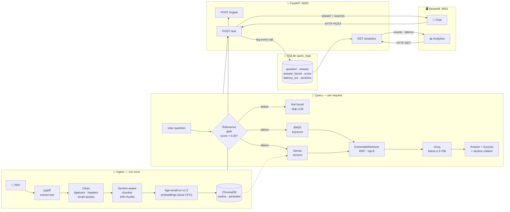

# Technical Report: RAG Q&A System over the AWS Customer Agreement

This report walks through every meaningful decision I made building this system —
what I chose, why I chose it over the alternatives, and the problems I ran into
along the way. I've tried to be honest about the trade-offs rather than presenting
everything as obvious in hindsight.

---

## 1. What I built, and the one principle behind it

The system answers plain-English questions about the AWS Customer Agreement (a
19-page, ~10,000-word contract). It's a FastAPI backend that runs a RAG pipeline
and logs every query to SQLite, with a Streamlit app on top for chatting and
viewing analytics.

The principle I kept coming back to: **keep it free, keep it local where it
matters, and keep it simple enough that I can justify every line.** A legal-Q&A
tool that's a black box is worse than useless, so I avoided heavy abstractions and
anything I couldn't explain. That single principle decided a lot of the smaller
calls below.

---

## 2. Architecture overview

There are two phases — **ingest** (run once) and **query** (every request). The
Streamlit frontend and FastAPI backend run as separate processes and only talk
over HTTP.

### How ingestion works (run once)

This is the left-bottom lane of the diagram. It only runs when the document is
first loaded (or after I change the chunking):

1. **Read the PDF** — `pypdf` pulls the raw text out of all 19 pages.
2. **Clean it** — fix ligatures (NFKC), strip the repeating page header/footer,
   and fold smart quotes / drop junk characters.
3. **Chunk it** — split on the contract's own section numbering into 106
   self-contained chunks, each tagged with its section number and title (and
   Section 12 split one chunk per defined term).
4. **Embed it** — turn every chunk into a 384-dimension vector with the local
   `bge-small-en-v1.5` model.
5. **Store it** — write the vectors into ChromaDB with cosine similarity, and
   persist them to disk so this whole step never has to run again on restart.

### How a question is answered (every request)

This is the middle lane. It runs on every call to `POST /ask`:

1. **Receive the question** at the API and validate it (an empty question is
   rejected before anything else happens).
2. **Relevance gate** — embed the question and check its best similarity score
   against the document. If it's below 0.45, the question is out of scope, so I
   return a "not found" reply immediately and *skip the LLM entirely*.
3. **Hybrid retrieve** — if it passes the gate, run two retrievers in parallel:
   BM25 (keyword) and dense vector search over ChromaDB.
4. **Fuse** — combine both result lists with reciprocal-rank fusion
   (`EnsembleRetriever`) and keep the top 8 chunks.
5. **Generate** — send those chunks to Groq's `llama-3.3-70b` as labelled
   context, with instructions to answer only from them, cite the section, and
   reply `NOT_FOUND` if the answer isn't there.
6. **Log and return** — write the question, answer, whether it was found, the
   score, the sections used and the latency into SQLite, then return the answer
   plus its source sections to the caller.

### Why two separate processes

The Streamlit frontend never imports the backend code — it only makes HTTP calls
to the FastAPI endpoints (`/ask`, `/analytics`). That keeps the UI and the
pipeline cleanly decoupled: either can be restarted, replaced or run on a
different machine without touching the other, and the same API could serve a
different frontend (or another service) unchanged.

---

## 3. Framework: LangChain vs wiring it by hand

**Decision:** Use LangChain for the pipeline glue.

**Why:** LangChain gives a clean, swappable interface over the three moving parts
that tend to change — the embedding model, the vector store, and the LLM. That
mattered here because my provider situation shifted mid-build (more on that in
section 4), and LangChain let me swap the LLM with a one-line change instead of
rewriting glue code.

**What I considered instead:** Writing the retrieval and prompt assembly from
scratch with just `sentence-transformers` and the provider SDK. That's genuinely
cleaner in terms of dependencies and arguably easier to defend line-by-line. I
went with LangChain because the swappability paid for itself, but I deliberately
used only the low-level pieces (the retrievers, the message objects) rather than
the high-level "do everything" chains — so I still understand and control each
step rather than hiding it behind `RetrievalQA`.

**Challenge:** LangChain recently moved to version 1.x and reorganized its
packages. `EnsembleRetriever` is no longer at `langchain.retrievers` — it now
lives in `langchain_classic.retrievers`. I hit a `ModuleNotFoundError`, traced it
by probing the installed packages, and fixed the import. Worth knowing because a
lot of online examples still use the old path.

---

## 4. Provider choices: where compute runs

### The LLM — Groq's llama-3.3-70b
**Decision:** Generate answers with Groq's free hosted API.

**Why:** It's free with no credit card, it's fast, and it runs a 70B Llama model —
much stronger than anything I could run locally. Temperature is set to 0 so answers
are deterministic and stick to the facts, which is what you want for a contract.

**What I considered, and why I rejected each:**
- **Ollama (local):** my first choice, because it's fully offline and self-
  contained. I dropped it because I couldn't install it on my machine (disk/space
  constraints), and even when it works it leans on local CPU/RAM.
- **OpenAI:** simplest and highest quality, but it costs money and needs a paid
  key. The brief explicitly allows free options, so paying wasn't justified.
- **HuggingFace Inference API:** free, but the free tier is rate-limited and slow
  for chat models, which would hurt the demo and the 36-query test run.
- **Google Gemini:** a genuinely good free option I nearly used; I picked Groq for
  raw speed and because its OpenAI-compatible interface made the LangChain wiring
  trivial.

**Why this matters architecturally:** only *generation* is hosted. The embedding
model runs locally, which keeps retrieval free and offline and means I can swap the
LLM provider without touching the index.

### Embeddings — local, not hosted
**Decision:** Run embeddings locally with `sentence-transformers`.

**Why:** No API key, no cost, no rate limits, works offline, and it decouples
retrieval from whatever LLM I'm using. The document is small, so embedding all of
it on CPU takes a second or two — there's no reason to pay a hosted embedding API.

---

## 5. Reading the PDF

**Decision:** Extract text with `pypdf`. No OCR.

**Why:** This PDF has a real, embedded text layer — `pypdf` pulls ~60,000
characters of clean text straight out. OCR is for *scanned* documents (images of
text with no text layer); running it on a digital PDF would be slower and would
*introduce* character-recognition errors on text that's already perfect.

**What I considered:** `pdfplumber` and `PyMuPDF`, which are better at preserving
layout/tables. I stuck with `pypdf` because it's lightweight and the text quality
was already good; the table problem (section 17) isn't something any of these
fully solve anyway.

**Challenge:** the raw text has three kinds of noise that I had to deal with, which
leads into the next section.

---

## 6. Cleaning the text

The extraction looked clean at a glance but had three real problems. I tested by
dumping the character codepoints, which is how I found each one.

**Ligatures.** "defined" came out as "defined", "affiliates" as "affiliates" — the PDF
stores `fi`/`ff`/`fl` as single typographic glyphs. To an embedding model,
"defined" and "defined" are different strings, so this quietly hurts retrieval. I
fix it with Unicode **NFKC normalization**, which decomposes those glyphs back to
plain ASCII in one line.

**Repeating header/footer.** Every page carries "6/16/26, 12:40 PM AWS Customer
Agreement" and a page URL like ".../agreement/ 3/19". If I left those in, that
noise would land in every single chunk and dilute the embeddings. Two regexes strip
them.

**Smart quotes and junk characters.** The curly quotes and dashes I fold to plain
ASCII (cleaner citations, no encoding surprises). I also found a handful of
private-use-area characters (codepoints like U+EDDB) — font-encoding garbage left
over from the broken tables — and strip those, since they carry no meaning.

**Challenge worth mentioning:** when I first wrote the private-use-area regex, I
typed the actual junk characters into the source file and they got mangled by the
editor/console encoding, producing a broken pattern. I rewrote it using the escape
range `[-]` instead, so the source stays plain ASCII and never
corrupts. Small thing, but it's the kind of detail that silently breaks a build.

---

## 7. Chunking — the decision I spent the most time on

**Decision:** Split the document along its own section numbering (1, 1.1, 2.3, …
12), tag each chunk with its section number and title, and split Section 12
(Definitions) one entry per term. Cap chunks at 1000 characters with 150
characters of overlap.

**Why section-aware:** the agreement numbers every clause. That's a gift — instead
of cutting blindly every N characters and risking a split mid-clause, I split on
the numbering so each chunk is one coherent legal clause. Two payoffs: chunk
boundaries line up with *semantic* boundaries (better retrieval precision), and
because I store the section label, answers can cite "Section 3.1 — Fees and
Payment" instead of an opaque "chunk 14". For a legal document, traceable citations
are a real feature, not a nicety.

**What I considered instead, and why I rejected it:**
- **`RecursiveCharacterTextSplitter`** (the standard fixed-size splitter): simplest
  and perfectly defensible, but it cuts on arbitrary character boundaries and gives
  no section metadata, so citations would be meaningless and a clause could be
  split awkwardly. The document's explicit structure was too good to throw away.
- **Semantic chunking** (split where embedding similarity drops): clever, but it's
  unpredictable, needs embeddings just to chunk, and is pointless when the document
  *already tells you* where the boundaries are via its numbering.
- **Agentic chunking** (an LLM decides the splits): far too expensive and slow for
  no benefit on a document this structured.

**Why per-term definitions:** Section 12 is a glossary of ~30 defined terms ("Your
Content" means…). If I let the size-splitter chop it into 1000-character blocks,
one chunk would mix several unrelated definitions, and a question like "what does
Your Content mean?" would retrieve a muddy block. Splitting one chunk per term
means definition questions land on exactly the right definition. This turned out to
matter — it's why "what does Your Content mean?" works cleanly.

**Why 1000 chars / 150 overlap specifically:** this is a balance of four things.
The hard ceiling is the embedder's 512-token window (~2000 chars) — go over and
text gets silently truncated, so I stay well under at ~250 tokens. Then it's a
trade-off: smaller chunks give sharper, more precise matches but fragment ideas and
force me to retrieve more of them; larger chunks keep whole clauses together but
blur the embedding across multiple ideas and feed the LLM more noise. Since my
section-aware split already aligns chunks to clauses, 1000 is really just a safety
cap for the few long sections (like 11.5, which spans a page). The 150-character
(~15%) overlap means a clause that does get split still carries context across the
boundary. I confirmed empirically that smaller (600) over-fragmented and larger
(1500) bought nothing.

**Challenges I hit:**
- **False headings.** My heading regex first matched "35 TheGardens" (from an
  address table) as a section. I fixed it by only accepting top-level numbers 1–12,
  since those are the real sections.
- **Bare titles.** Top-level headings like "1. AWS Responsibilities" have no body
  of their own (the content is in 1.1, 1.2…), so they produced useless 23-character
  chunks. I drop those and carry the title down onto the sub-sections beneath them,
  which is also where the section *title* in citations comes from.
- The end result: 106 chunks, averaging ~600 characters, 29 of them definitions.

---

## 8. Embedding model

**Decision:** `BAAI/bge-small-en-v1.5`, with normalized vectors.

**Why:** It's small (384 dimensions), runs free on CPU, and scores better on
retrieval benchmarks than the usual `all-MiniLM-L6-v2` default — at the same size.
Its 512-token window fits my chunks with room to spare. I normalize the embeddings
because that's what the model's authors recommend for cosine similarity, and the
effect is visible in the scores (see section 11).

**What I considered, and why not:**
- **all-MiniLM-L6-v2:** the most common default and what most tutorials use. It's
  the simplest choice, but it's measurably weaker on retrieval, and bge-small costs
  nothing extra to use.
- **gte-small:** very close to bge-small and needs no instruction prefix; a fine
  alternative, just slightly less well-known.
- **bge-base / bge-large / BGE-M3:** higher quality but bigger and slower on CPU,
  with diminishing returns on a 10,000-word document. Overkill.

I researched the current (2026) options rather than defaulting blindly, and
bge-small was the sweet spot of quality, size, and CPU speed.

---

## 9. Vector store

**Decision:** ChromaDB, cosine space, persisted to disk.

**Why:** Chroma persists to disk with almost no effort, has a friendly API, and is
explicitly allowed by the brief. Persisting matters because it means I embed the
document once and reload instantly on restart, instead of re-embedding every time
the server boots.

**What I considered:** FAISS, which is lighter and what I'd reach for if I needed
raw speed at scale. For one small document the difference is irrelevant, and FAISS
is in-memory by default so I'd have to manage saving/loading myself. Chroma was the
more practical choice here.

**Challenge — the distance-vs-similarity trap:** Chroma stores cosine *distance*,
but its `similarity_search_with_relevance_scores` returns a *relevance* score in
[0, 1] (it does the `1 - distance` conversion for you). This trips a lot of people
up when setting thresholds. I use that relevance score directly for the not-found
gate, and I left a comment in the code so the next person doesn't get caught out.

---

## 10. Retrieval — hybrid search, and tuning k

**Decision:** Hybrid retrieval — BM25 (keyword) plus dense vector search — fused
with reciprocal-rank fusion via `EnsembleRetriever`, weighted 0.3 BM25 / 0.7 dense.
Use the top 8 fused chunks.

**Why hybrid:** the two methods fail in different ways, so together they cover each
other. Dense vectors handle wording that doesn't match literally ("terminate" vs
"cancel"). BM25 nails exact strings that a contract cares about — defined terms
like "Your Content", or a literal reference like "Section 11.5" — which dense
search sometimes drifts past. I weight dense higher (0.7) because it's the stronger
general signal; BM25 is there to catch the exact-term cases.

**What I considered, and why not:**
- **Dense only:** simpler, and it's most of the value. I added BM25 because legal
  text leans on exact defined terms and section numbers, which is exactly BM25's
  strength — a small addition for a real gain on this kind of document.
- **Keyword/BM25 only:** would miss all the paraphrased questions. Not viable on
  its own for natural-language queries.
- **Cross-encoder reranking:** genuinely useful when first-stage retrieval is
  noisy. With only 106 chunks in a single coherent document, retrieval isn't noisy,
  so reranking would add a model and ~100ms+ per query for almost no gain. Left out
  on purpose.
- **Multi-query retrieval:** rephrases the question into several variants with the
  LLM and retrieves for each. That's extra LLM calls and latency per question, and
  it mostly helps with vague queries over large messy corpora — not a small,
  well-structured contract. Also left out on purpose.

**The k tuning challenge (my favourite debugging moment):** I started with k=5, and
three questions that *should* have been answerable came back as not-found — for
example "how does AWS handle events beyond its control?". My first instinct was that
the prompt was too strict. But when I actually inspected what got retrieved, the
relevant clause (11.3, Force Majeure) *was* being found — just at rank 6 or 7, so my
top-5 cut was throwing it away before it reached the LLM. The reason it ranked low:
the question says "natural disasters", the contract says "acts of God, earthquake,
storms" — semantically close, but zero shared keywords for BM25 to latch onto.
Raising k to 8 brought 11.3 up into the context and recovered the other misses too.
On a 106-chunk corpus the extra context is essentially free, and it lifted the
answered rate from 27/36 to 29/36. The lesson: diagnose retrieval before blaming the
prompt.

---

## 11. Not hallucinating — the two-layer "I don't know"

**Decision:** Two independent layers decide when to say the answer isn't in the
document.

**Why two layers:** neither is reliable enough alone, and they catch different
failure modes.

**Layer 1 — relevance gate.** If the best dense relevance score is below 0.45, I
treat the question as out of scope and return a not-found message *without calling
the LLM at all*. It's cheap, it's deterministic, and it gives the analytics a clean
signal (a low-score rejection means a genuine gap, not an LLM judgement call). I
chose 0.45 from the data: I measured that in-scope questions score around 0.75–0.89
and clearly out-of-scope ones around 0.45, so the threshold sits in that gap with a
safety margin.

**Layer 2 — the prompt.** The system prompt tells the model to answer *only* from
the provided context and to reply with exactly `NOT_FOUND` if the answer isn't
there. This catches the cases that slip past the gate. The clearest example: "what's
the price of an EC2 instance?" scores 0.66 — above the gate — because the contract
*does* mention EC2 in passing (Reserved Instances). The gate lets it through, but
there's no price anywhere in the document, so the model correctly declines. Without
Layer 2, that one would have produced a made-up answer.

**Challenge:** detecting the `NOT_FOUND` reply reliably. The model occasionally
wraps it in a sentence, so I check whether `NOT_FOUND` appears in the (upper-cased)
response rather than requiring an exact match, and map that to `answer_found =
False` for logging.

---

## 12. The prompt and generation settings

**Decision:** A system + human message pair, temperature 0, context fed as labelled
blocks.

**Why:** Temperature 0 makes answers deterministic and factual — I don't want
creativity in a contract assistant. I format each retrieved chunk as a labelled
block ("[Section 3.1 — Fees and Payment] …") so the model has the section number
right next to the text and can cite it. The system prompt is explicit about
answering only from context and citing the section, which is what keeps answers
grounded and traceable.

---

## 13. SQL logging and analytics

**Decision:** SQLite, one row per `/ask` call, with a schema chosen to power the
required analytics directly.

**Why SQLite:** zero configuration, no server to run, a single file — exactly right
for this scale, and the brief says it's sufficient. PostgreSQL would be
over-engineering for a single-user analytics log.

**The schema and why each column exists:** `question` and `answer` (what happened);
`answer_found` as 0/1 (this is what powers the "no answer found" analytic);
`top_score` (retrieval confidence, useful for spotting borderline cases);
`retrieved_sections` as JSON (which clauses were used — traceability);
`num_chunks`; `latency_ms` (powers the "average latency" analytic); `model` and
`created_at` (which LLM, and when). Every column earns its place by feeding either
an analytic or an audit need.

**The three analytics, in plain SQL:**
- **Most frequent questions** — `GROUP BY LOWER(TRIM(question))`. I normalize case
  and whitespace so "What is the late payment rate?" and "what is the late payment
  rate? " count as the same question. Without that, free-text questions would
  almost never group and the stat would be meaningless.
- **No-answer queries** — `WHERE answer_found = 0`.
- **Average latency** — `AVG(latency_ms)`, plus min/max and an answered-rate
  overview for context.

---

## 14. The API

**Decision:** FastAPI with Pydantic models and three endpoints (`/ingest`, `/ask`,
`/analytics`), plus a `/health` check.

**Why:** Pydantic gives validation and clear error messages for free, and FastAPI
auto-generates interactive docs at `/docs`. I build the RAG pipeline once on
startup (in the app lifespan) and keep it in app state, so requests don't reload the
models every time — that's the difference between a ~1s response and a ~10s one.

**Error handling decisions:** I return meaningful HTTP codes rather than stack
traces — 422 for an empty/whitespace question (caught by a Pydantic validator), 409
if you ask before any document is ingested, 503 if the LLM key is missing or Groq is
unreachable. The brief specifically asked for graceful edge-case handling, so I made
each failure mode return something a caller can actually act on.

**Challenge:** the LLM client wanted an API key at construction time, which meant the
pipeline couldn't even be built for retrieval-only testing without a key. I made the
LLM lazy — it's only constructed on the first actual generation — so retrieval works
without a key and you get a clear, specific error only if you try to generate
without one.

---

## 15. The frontend

**Decision:** Streamlit, running as a separate process that talks to the API over
HTTP.

**Why Streamlit over React:** the brief says both are fine and it's marking
functional integration, not visual polish. Streamlit gets a working chat-plus-
analytics UI in pure Python in a fraction of the time, and keeping it as a separate
process that only calls the API over HTTP is exactly the separation the brief asked
for.

**Challenge:** my first version put the chat input inside `st.tabs()`, and Streamlit
renders the input *inline* (mid-page) when it's nested in a tab, instead of pinning
it to the bottom like a normal chat box. I switched from tabs to a sidebar page
selector so the chat input sits at the top level of the page, which restores the
pinned-to-bottom behaviour. A good reminder that Streamlit's layout containers have
side effects on widget placement.

---

## 16. Testing

**Decision:** A script that fires 36 questions at the live endpoint — about 26
answerable across many sections, 6 deliberately out-of-scope, and a few repeats.

**Why:** the brief asks for at least 30 queries so the analytics have realistic
data. I mixed in out-of-scope questions on purpose to exercise the not-found path,
and repeated a few popular ones so the "most frequent" analytic actually shows
something. I also added a 2-second pause between calls to stay under Groq's
free-tier rate limit.

**Results:** 29 of 36 answered (~81%). Of the 7 not answered, 6 were genuinely
out-of-scope and correctly declined, and 1 depends on a broken table (next section).
Answers cited the right sections, and latency averaged ~1.3s end to end.

---

## 17. What I'd improve, and what I left out on purpose

**The real weak spot — tables.** The Contracting Party and Governing Law tables
(pages 15–17) extract as scrambled vertical fragments because the PDF's column
layout is lost. That's why "what law governs the agreement for AWS India?" misses —
the answer is in one of those tables. OCR wouldn't help, because the problem is
layout, not character recognition. The proper fix is a dedicated table parser (or a
layout-aware extractor like PyMuPDF), which I'd add given more time.

**Threshold tuning.** The 0.45 relevance gate is a single global number I
calibrated by eye. With a small labelled set of questions and expected answers, I
could tune it more rigorously on a precision/recall curve.

**Deliberate omissions.** I want to be explicit that leaving out cross-encoder
reranking and multi-query retrieval was a *decision*, not an oversight. Both are
techniques I understand and considered; both add latency and, for multi-query, extra
LLM calls; and for a single small, coherent document neither earns its cost. Knowing
when *not* to add a technique felt as important as knowing how to.
